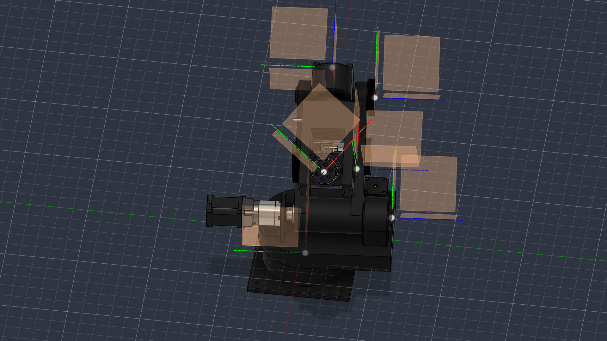

# 6DOF_URDF — Robot Description



## Overview

| Property | Value |
|----------|-------|
| Total mass | 5.614 kg |
| Links | 7 |
| Joints | 6 (6 movable) |
| Assemblies | 10 |
| Root link | `base_link` |

## Table of Contents

- [Kinematic Tree](#kinematic-tree)
- [Link Properties](#link-properties)
- [Joint Properties](#joint-properties)
- [Assembly Breakdown](#assembly-breakdown)
- [Quick Start (ROS 2)](#quick-start-ros-2)
- [Files](#files)

## Kinematic Tree

```
base_link
  └─ Revolute_5 [revolute]
    Shoulder [BAKE]
      └─ Revolute_13 [revolute]
        UA [BAKE]
          └─ Revolute_29 [revolute]
            Elbow [BAKE]
              └─ Revolute_37 [revolute]
                Roll [BAKE]
                  └─ Revolute_43 [revolute]
                    Yaw [BAKE]
                      └─ Revolute_46 [continuous]
                        Gripper [BAKE]
```

## Link Properties

| Link | Mass (kg) | Material | Collision | Bodies |
|------|-----------|----------|-----------|--------|
| `Elbow` | 0.7335 | — | convex_hull | 0 |
| `Gripper` | 0.0112 | — | convex_hull | 0 |
| `Roll` | 0.6824 | — | convex_hull | 0 |
| `Shoulder` | 2.0941 | — | convex_hull | 0 |
| `UA` | 1.2363 | — | convex_hull | 0 |
| `Yaw` | 0.2598 | — | convex_hull | 0 |
| `base_link` | 0.5967 | PETG_15_Gyroid | convex_hull | 1 |

## Joint Properties

| Joint | Type | Parent → Child | Axis | Limits |
|-------|------|---------------|------|--------|
| `Revolute_13` | revolute | `Shoulder` → `UA` | (0,0,1) | [0.0°, 360.0°] |
| `Revolute_29` | revolute | `UA` → `Elbow` | (0,0,1) | [0.0°, 360.0°] |
| `Revolute_37` | revolute | `Elbow` → `Roll` | (0,0,1) | [0.0°, 360.0°] |
| `Revolute_43` | revolute | `Roll` → `Yaw` | (0,0,1) | [0.0°, 360.0°] |
| `Revolute_46` | continuous | `Yaw` → `Gripper` | (0,0,1) | — |
| `Revolute_5` | revolute | `base_link` → `Shoulder` | (0,0,1) | [0.0°, 360.0°] |

## Assembly Breakdown

### 6DOF_URDF

- **Links**: base_link, UA, Elbow, Roll, Yaw, Gripper, Shoulder
- **Total mass**: 5.614 kg

### Belt_Shaft

- **Links**: 
- **Total mass**: 0.000 kg

### EG17_G10

- **Links**: 
- **Total mass**: 0.000 kg

### EG17_G50

- **Links**: 
- **Total mass**: 0.000 kg

### GT2_400mm_Motor_Connector

- **Links**: 
- **Total mass**: 0.000 kg

### GT2_Elbow_Connector

- **Links**: 
- **Total mass**: 0.000 kg

### Roll_Bearing_2

- **Links**: 
- **Total mass**: 0.000 kg

### Shaft_Connector

- **Links**: 
- **Total mass**: 0.000 kg

### UA_Shaft_COupler

- **Links**: 
- **Total mass**: 0.000 kg

### UA_Shaft_Coupler

- **Links**: 
- **Total mass**: 0.000 kg

## Quick Start (ROS 2)

```bash
# 1. Copy package to your ROS 2 workspace
cp -r 6DOF_URDF_description ~/ros2_ws/src/

# 2. Build
cd ~/ros2_ws
colcon build --packages-select 6DOF_URDF_description
source install/setup.bash

# 3. Visualize in RViz2
ros2 launch 6DOF_URDF_description display.launch.py

# 4. Validate URDF structure
check_urdf install/6DOF_URDF_description/share/6DOF_URDF_description/urdf/6DOF_URDF.urdf

# 5. Print kinematic tree
urdf_to_graphviz install/6DOF_URDF_description/share/6DOF_URDF_description/urdf/6DOF_URDF.urdf
```

**Joint control**: The launch file includes `joint_state_publisher_gui` —
use the sliders to move revolute/prismatic joints in RViz2.

**Topic inspection**:
```bash
# See published joint states
ros2 topic echo /joint_states

# See robot description parameter
ros2 param get /robot_state_publisher robot_description
```

## Files

| Path | Description |
|------|-------------|
| `urdf/6DOF_URDF.urdf.xacro` | Top-level xacro (entry point) |
| `urdf/6DOF_URDF.urdf` | Flat URDF (for validation) |
| `urdf/assemblies/` | Per-assembly xacro macros |
| `meshes/` | Visual (OBJ) and collision (STL) meshes |
| `launch/display.launch.py` | Launch robot_state_publisher, RViz, and generated controllers |
| `config/joint_state.yaml` | Joint state publisher config |
| `config/ros2_controllers.yaml` | Generated ros2_control controller manager config |
| `robot_data.yaml` | Supplementary data (beyond URDF) |
| `docs/transforms.md` | Transformation matrices (KaTeX) |

## Customizing

Assemblies tagged `!dummy_` are designed to be swapped out. To replace one:

1. Create your replacement as a xacro macro with the same interface
2. Place it in `urdf/assemblies/`
3. Update the `<xacro:include>` in `urdf/6DOF_URDF.urdf.xacro`
4. Update meshes in `meshes/<your_assembly>/`

The xacro prefix system (`${prefix}`) ensures link names stay unique
when multiple instances of the same assembly are used.

---
*Generated by Fusion URDF/XACRO Exporter v3.1.0*